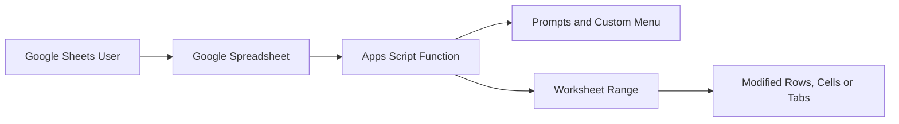
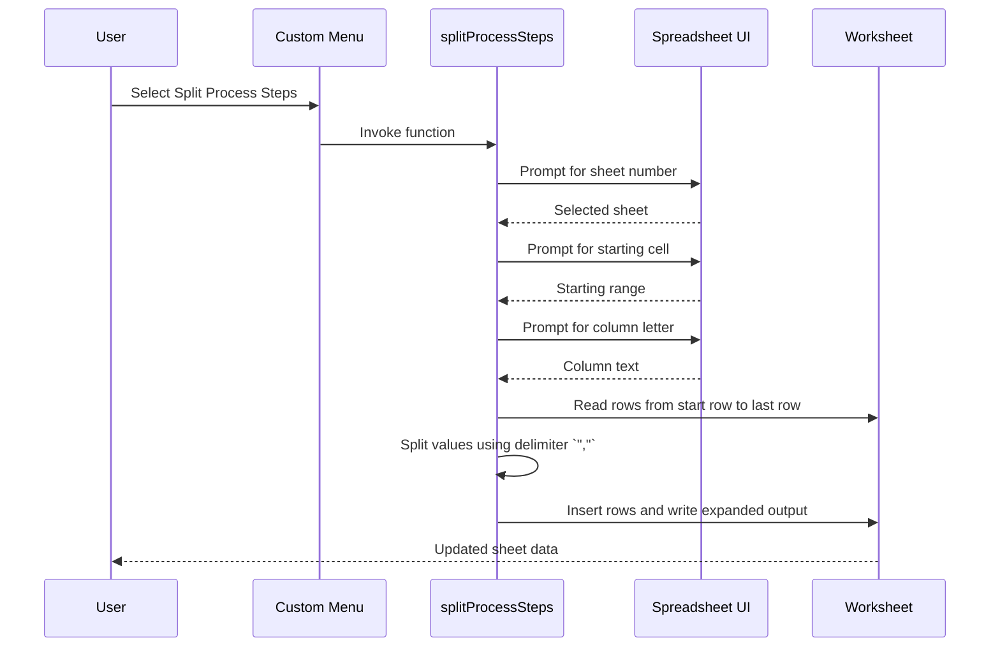

# Google Sheets Scripts

> **Document version:** R1.00  
> **Documentation status:** Reviewed from repository evidence  
> **Last code review:** 2026-07-14  
> **Repository:** https://github.com/Wattysaid/google_scripts  
> **Default branch:** `main`  
> **Commit reviewed:** `61c3f8f91cf22ba04b1b6b418a8f442e787bc1ed`  
> **Maintainer:** Wattysaid

Google Sheets Scripts is a personal collection of Google Apps Script utilities for automating spreadsheet transformation and workbook-navigation tasks. The repository contains independently installed scripts for splitting process-step content, replacing text with line breaks, formatting tabs and creating summary sheets with navigation links.

## Documentation Scope and Verification

| Item | Value |
|---|---|
| Repository reviewed | `https://github.com/Wattysaid/google_scripts` |
| Branch | `main` |
| Commit | `61c3f8f91cf22ba04b1b6b418a8f442e787bc1ed` |
| Review date | `2026-07-14` |
| Reviewer | `GPT-5.6 Thinking` |
| Review method | Static inspection of README and `cellSplitV2` source |
| Commands executed | None; scripts were not run in Google Sheets |
| Excluded areas | Google authorisation flow, workbook-specific behaviour and complete file-by-file execution |
| Confidence | Medium; documented purpose and selected source are evidenced, but runtime behaviour was not executed |

### Documentation Status Legend

| Status | Meaning |
|---|---|
| **Verified** | Confirmed through source inspection and successful validation or tests |
| **Implemented, not executed** | Code exists and was inspected, but execution was not performed |
| **Partial** | Some expected handling or documentation is incomplete |
| **Unknown** | Evidence is insufficient or contradictory |

## Contents

- [Repository Purpose](#repository-purpose)
- [Script Catalogue](#script-catalogue)
- [Architecture and Execution Model](#architecture-and-execution-model)
- [Split Process Steps Workflow](#split-process-steps-workflow)
- [Inputs, Outputs and Side Effects](#inputs-outputs-and-side-effects)
- [Permissions and Security](#permissions-and-security)
- [Testing and Quality Assurance](#testing-and-quality-assurance)
- [Getting Started](#getting-started)
- [Known Limitations and Risks](#known-limitations-and-risks)
- [Safe Change Guidance](#safe-change-guidance)
- [Release and Versioning](#release-and-versioning)
- [Changelog](#changelog)
- [Licence](#licence)

## Repository Purpose

The collection is intended to:

- Reduce repetitive Google Sheets work.
- Provide reusable personal automation snippets.
- Support experimentation with Google Apps Script.
- Retain utilities that have previously reduced manual effort.

These scripts are not represented as production-grade controls. Review and test each script against a copy of the target spreadsheet before use.

## Script Catalogue

| Script or File | Purpose | Status | Primary Side Effect | Notes |
|---|---|---|---|---|
| `splitCellContent` | Split line-break-separated cell content across multiple rows | Implemented, not executed | Inserts or rewrites sheet rows | Exact current file path was not revalidated |
| `newRow` | Replace configured strings with line breaks in a selected column | Implemented, not executed | Modifies cell values | Replacement rules require source review |
| `formatAllTabs` | Apply formatting across workbook tabs | Partial documentation | Potentially modifies every sheet | Behaviour was not described in the previous README |
| `contentSummary` | Create a `Summary` tab containing links to workbook tabs | Implemented, not executed | Creates or changes a sheet | Existing-summary handling should be verified |
| `cellSplitV2` / `splitProcessSteps` | Select a sheet and expand delimited process steps into separate rows | Implemented, not executed | Inserts rows and rewrites a data range | Source inspection identified several correctness risks |

## Architecture and Execution Model

Each script runs inside the Google Sheets Apps Script environment. The browser-based spreadsheet supplies the active workbook, user interface, selected range and authorisation context.

No external database, service API or deployment pipeline was verified.

## Split Process Steps Workflow

The inspected `cellSplitV2` file defines `splitProcessSteps()` and helper functions for sheet selection, starting-cell input, column-letter input and a custom menu.

### Implemented Behaviours

- Builds a numbered list of workbook sheets.
- Prompts the user to select a sheet.
- Prompts for a starting-cell address.
- Prompts for a column letter.
- Reads rows from the selected starting row to the sheet's last row.
- Splits process-step text on the literal delimiter `","`.
- Removes leading and trailing quotation marks from split values.
- Duplicates all other columns for each generated step.
- Adds a **Custom Scripts** menu through `onOpen()`.

## Inputs, Outputs and Side Effects

| Input | Source | Validation | Output or Side Effect | Risk |
|---|---|---|---|---|
| Spreadsheet | Active Google Sheets document | Assumed present | Workbook changes | Medium |
| Sheet number | UI prompt | Range checked against sheet count | Chooses target sheet | Low |
| Starting-cell address | UI prompt | `getRange` attempted | Sets start row and process-step column | Medium |
| Column letter | UI prompt | Converted through active-sheet range | Intended to select a source column | Medium; value is calculated but not used in current main logic |
| Delimited process-step text | Cells from starting row onward | Non-empty check | Expanded rows | High when delimiter differs from expected format |
| Generated row array | In-memory output | No explicit empty-output guard | Rows inserted and range overwritten | High |

## Permissions and Security

Google Apps Script may request permission to read and modify spreadsheets. Grant access only after reviewing the script source.

| Control Area | Current Behaviour | Known Gap |
|---|---|---|
| Workbook access | Uses active spreadsheet | No restriction to specific workbook IDs |
| Sheet mutation | Inserts rows and writes values | No backup, preview or dry-run mode |
| User confirmation | Prompts for sheet and positions | No final confirmation of affected row count |
| External data transfer | None evidenced in inspected script | Other repository scripts were not exhaustively inspected |
| Audit trail | Google revision history may record changes | Script does not create a structured execution log |

## Testing and Quality Assurance

No automated Apps Script test suite was verified.

| Test Type | Scenario | Reviewed Result | Gap |
|---|---|---|---|
| Normal data | Multiple quoted steps in the expected delimiter format | Not run | Output correctness unverified |
| Empty output | No populated process-step cells | Not run | `insertRowsAfter(startRow, output.length - 1)` may receive an invalid count |
| Sheet consistency | Selected sheet differs from active sheet | Not run | Starting-cell helper uses `getActiveSheet`, potentially selecting a range from a different sheet |
| Column selection | User enters a column different from the starting cell column | Not run | Calculated `columnNumber` is not used to select process-step data |
| Boundary rows | Starting row is the final populated row | Not run | Insertion and overwrite behaviour unverified |
| Delimiter variation | Newlines, commas or unquoted steps | Not run | Only literal `","` splitting is implemented |
| Repeated execution | Run script twice on already expanded data | Not run | Duplicate expansion risk |

## Getting Started

### Install a Script

1. Open the target Google Sheets document.
2. Select **Extensions > Apps Script**.
3. Create or select a script file.
4. Copy the reviewed script into the editor.
5. Save the project.
6. Reload the spreadsheet if the script defines `onOpen()`.
7. Review and approve only the permissions required by the script.

### Run a Script

1. Create a backup or duplicate of the spreadsheet.
2. Adjust sheet names, ranges, delimiters and constants where required.
3. Run the function from the Apps Script editor, the Macros menu, a custom menu or an assigned button.
4. Review the affected rows before continuing work.

### Split Process Steps

1. Reload the spreadsheet to create the **Custom Scripts** menu.
2. Select **Custom Scripts > Split Process Steps**.
3. Choose a sheet number.
4. Enter the starting cell containing the process-step column.
5. Enter the requested column letter.
6. Review the generated rows carefully before retaining the changes.

## Known Limitations and Risks

| ID | Area | Finding | Impact | Priority | Recommended Action |
|---|---|---|---|---|---|
| DOC-RISK-001 | Sheet selection | `selectSheet()` returns a sheet, but `promptForStartingCell()` reads from `getActiveSheet()` | Range and data may refer to different sheets | P0 | Pass the selected sheet into the starting-cell helper |
| DOC-RISK-002 | Column selection | `columnNumber` is calculated but the function uses `startingCell.getColumn()` | User-entered column letter has no effect | P1 | Use one canonical source-column input and remove ambiguity |
| DOC-RISK-003 | Empty output | Row insertion uses `output.length - 1` without an explicit zero-output guard | Runtime error or invalid insertion request | P1 | Return safely when no rows are generated |
| DOC-RISK-004 | Destructive rewrite | Output is written from `startRow` across all current columns | Existing rows may be overwritten or shifted unexpectedly | P0 | Add preview, target range calculation and explicit confirmation |
| DOC-RISK-005 | Delimiter handling | Splitting depends on the exact string `","` | Common input formats may not split correctly | P1 | Parse a defined CSV or newline format rather than a literal delimiter |
| DOC-RISK-006 | Repeatability | No marker prevents expanding already expanded rows | Duplicate data on repeated execution | P1 | Add idempotency checks or a processed-state column |
| DOC-RISK-007 | Auditability | No structured execution record | Difficult to identify what changed | P2 | Write an optional audit sheet or execution summary |
| DOC-RISK-008 | Licence | No licence was verified | Reuse rights unclear | P2 | Add an intentional licence or retain private-use restrictions |

## Safe Change Guidance

- Preserve all current scripts unless removal is explicitly authorised.
- Pass the selected spreadsheet and sheet explicitly rather than relying on active context.
- Add a non-destructive preview or dry-run mode before row insertion.
- Validate generated row counts and output ranges before writing.
- Treat sheet names, column positions and delimiters as compatibility-sensitive configuration.
- Test normal, empty, malformed and repeated-execution scenarios on a disposable workbook.
- Document required permissions and external calls for every new script.
- Update this README whenever functions, prompts, permissions or destructive side effects change.

## Release and Versioning

| Item | Approach | Source of Truth |
|---|---|---|
| Script version | Commit-based unless recorded in a script | Git history |
| Spreadsheet schema compatibility | Not formally versioned | Script assumptions and documentation |
| Documentation version | `R1.00` | `README.md` |

## Changelog

| Documentation Version | Date | Commit Reviewed | Author | Summary |
|---|---|---|---|---|
| R1.00 | 2026-07-14 | `61c3f8f91cf22ba04b1b6b418a8f442e787bc1ed` | GPT-5.6 Thinking | Reorganised the script collection documentation, retained existing setup and catalogue content and documented correctness risks found in `cellSplitV2` |

## Licence

No licence file was verified. Unless a licence exists elsewhere in the repository, reuse rights are not granted by default.
